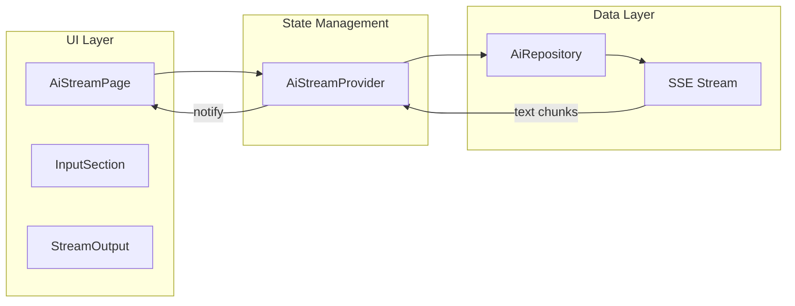

# AI 流式页面重构计划

## 概述

根据 [AI_STREAM_API_FLUTTER_GUIDE.md](API_DOC/AI_STREAM_API_FLUTTER_GUIDE.md) 文档，创建新的流式 AI 项目匹配页面，使用 `/api/v1/ai/query-stream` 接口，实现打字机效果的流式输出。

---

## 架构设计



---

## 实现步骤

### 1. 扩展 AiRepository - 添加流式查询方法

在 [ai_repository.dart](lib/features/ai/data/repositories/ai_repository.dart) 中添加：

```dart
/// AI 项目查询（流式）
Stream<String> queryProjectsStream({
  required String userInput,
  String? sessionId,
}) async* {
  // 使用 SSE 解析 /api/v1/ai/query-stream 响应
  // 逐步 yield 文本片段
}
```

### 2. 创建新的 Provider - AiStreamProvider

创建 `lib/features/ai/providers/ai_stream_provider.dart`：

- 管理输入文本、流式输出文本、加载状态
- 处理 Stream 订阅和取消
- 实现打字机效果的文本累积

### 3. 创建新的流式 AI 页面

创建 `lib/features/ai/presentation/pages/ai_stream_page.dart`：

**UI 结构：**

- 顶部导航栏（返回按钮 + 标题）
- 输入区域卡片（描述信息输入框 + 发送按钮）
- 流式输出区域（打字机效果展示 AI 分析过程）
- 项目匹配结果卡片列表（流式结束后展示）

**交互效果：**

- 输入时禁用发送按钮
- 流式输出时显示闪烁光标
- 支持取消正在进行的请求

### 4. 更新搜索框跳转入口

修改 [project_search_bar.dart](lib/features/home/presentation/widgets/project_search_bar.dart)：

将 `_navigateToAiPage` 方法中的跳转目标从 `AiPage` 改为新的 `AiStreamPage`。

---

## 文件清单

| 操作 | 文件路径 |

|-----|---------|

| 修改 | `lib/features/ai/data/repositories/ai_repository.dart` |

| 新建 | `lib/features/ai/providers/ai_stream_provider.dart` |

| 新建 | `lib/features/ai/presentation/pages/ai_stream_page.dart` |

| 修改 | `lib/features/home/presentation/widgets/project_search_bar.dart` |

---

## 关键技术点

1. **SSE 解析**：使用 Dio 的 `ResponseType.stream` 配合 UTF-8 解码和行分割
2. **JWT 认证**：请求头携带 `Authorization: Bearer <token>`
3. **流式取消**：通过 `StreamSubscription.cancel()` 支持用户中断
4. **打字机效果**：使用 `ThinkingCursor` 组件显示闪烁光标