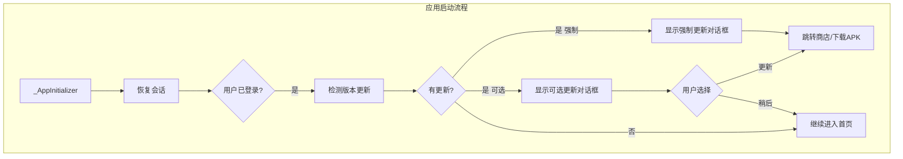

# APP 版本更新检测功能实现

## 架构设计

## 实现步骤

### 1. 添加依赖

修改 [pubspec.yaml](pubspec.yaml)，添加 `package_info_plus` 用于获取运行时版本信息。

### 2. 创建数据模型

新建 `lib/features/app_update/data/models/app_update_check_vo.dart`：

- 包含 `hasUpdate`、`force`、`latestVersionName`、`storeUrl`、`downloadUrl`、`releaseNotes` 等字段

### 3. 创建更新服务

新建 `lib/features/app_update/data/services/app_update_service.dart`：

- 调用 `POST /api/app/update/check` 接口
- 使用硬编码的 `appKey: yaby_app`
- 根据平台设置 `channelCode`: Android 为 `official`，iOS 为 `appstore`
- 通过 `package_info_plus` 获取 `versionName` 和 `buildNumber`
- 通过 `device_info_plus` 获取 `deviceId`

### 4. 创建更新对话框

新建 `lib/features/app_update/presentation/widgets/app_update_dialog.dart`：

- 显示版本号、更新说明列表
- 强制更新模式：只有"立即更新"按钮，不可关闭
- 可选更新模式："立即更新"和"稍后提醒"按钮
- 点击更新：iOS 跳转 App Store，Android 优先使用 `downloadUrl` 下载 APK，无则跳转商店

### 5. 集成到启动流程

修改 [lib/app.dart](lib/app.dart) 中的 `_AppInitializer`：

- 在用户登录成功跳转首页后，调用更新检测
- 根据返回结果显示对应的更新对话框