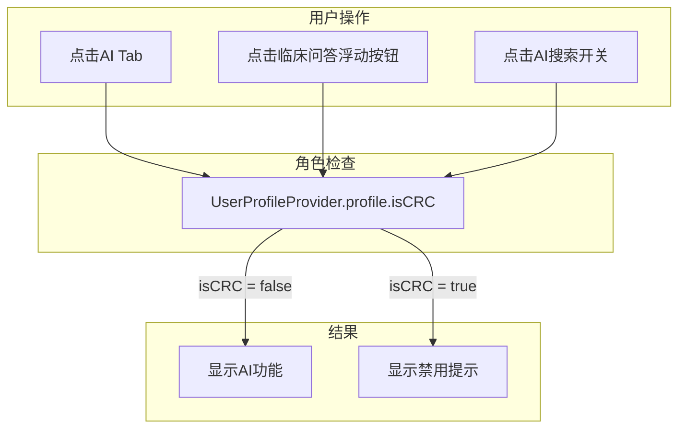

# CRC用户AI功能限制实现

## 需求分析

当登录用户角色为CRC（临床研究协调员）时，禁用所有AI功能：

- 底部导航栏AI Tab不可用
- 首页浮动按钮（临床问答入口）不可用
- 项目搜索页面AI开关不可点击

## 核心判断逻辑

用户角色通过 `UserProfile` 模型的 `roleCode` 或 `roleName` 字段判断：

- `roleCode == 'CRC'` 或
- `roleName == '临床研究协调员'`

参考代码（已有类似逻辑）：

```69:85:lib/features/address_book/data/models/address_book_item_model.dart
  String? get displayRoleName {
    // ...
    if (roleCode == 'CRC' || roleName == '临床研究协调员') {
      return 'CRC';
    }
    // ...
  }
```

## 修改方案

### 1. 在 UserProfile 模型中添加便捷方法

文件：[`lib/features/auth/data/models/user_profile.dart`](lib/features/auth/data/models/user_profile.dart)

添加 `isCRC` getter：

```dart
/// 判断是否为CRC角色
bool get isCRC => roleCode == 'CRC' || roleName == '临床研究协调员';
```

### 2. 修改首页（HomePage）

文件：[`lib/features/home/presentation/pages/home_page.dart`](lib/features/home/presentation/pages/home_page.dart)

需要修改的位置：

**a) 底部导航栏AI Tab点击拦截**（第186-191行 `_onTapTab` 方法）

- 当点击AI Tab（index=2）时，检查用户角色
- CRC用户显示SnackBar提示"CRC角色暂不支持使用AI功能"

**b) 浮动按钮禁用**（第216-247行）

- CRC用户隐藏临床问答浮动按钮，或点击时显示提示
- 推荐方案：CRC用户只显示发帖按钮，隐藏临床问答按钮

**c) `_openXiaobaiChat` 方法**（第194-204行）

- 添加CRC角色检查

### 3. 修改AI入口页面（AiEntryPage）

文件：[`lib/features/ai/presentation/pages/ai_entry_page.dart`](lib/features/ai/presentation/pages/ai_entry_page.dart)

- 检测到CRC用户时，显示"您当前角色暂不支持使用AI功能"的提示页面
- 替代原有的功能卡片

### 4. 修改项目搜索栏（ProjectSearchBar）

文件：[`lib/features/home/presentation/widgets/project_search_bar.dart`](lib/features/home/presentation/widgets/project_search_bar.dart)

两种实现方案：

**方案A（推荐）：组件内部判断**

- 在组件内部通过 `context.read<UserProfileProvider>()` 获取用户角色
- CRC用户时禁用AI开关（视觉上变灰，点击无响应或显示提示）

**方案B：外部传参**

- 添加 `aiEnabled` 参数，由父组件传入
- 需要修改 `ProjectListPage` 调用处

推荐方案A，因为：

- 修改范围更小
- 逻辑更内聚
- 不需要修改调用方

### 5. 提示信息统一

所有限制处使用统一的提示文案：

- 标题：无
- 内容："CRC角色暂不支持使用AI功能"

## 架构图



## 修改文件汇总

| 文件 | 修改内容 |

|------|---------|

| `lib/features/auth/data/models/user_profile.dart` | 添加 `isCRC` getter |

| `lib/features/home/presentation/pages/home_page.dart` | 修改 `_onTapTab`、浮动按钮、`_openXiaobaiChat` |

| `lib/features/ai/presentation/pages/ai_entry_page.dart` | 添加CRC用户禁用页面 |

| `lib/features/home/presentation/widgets/project_search_bar.dart` | 禁用AI开关 |