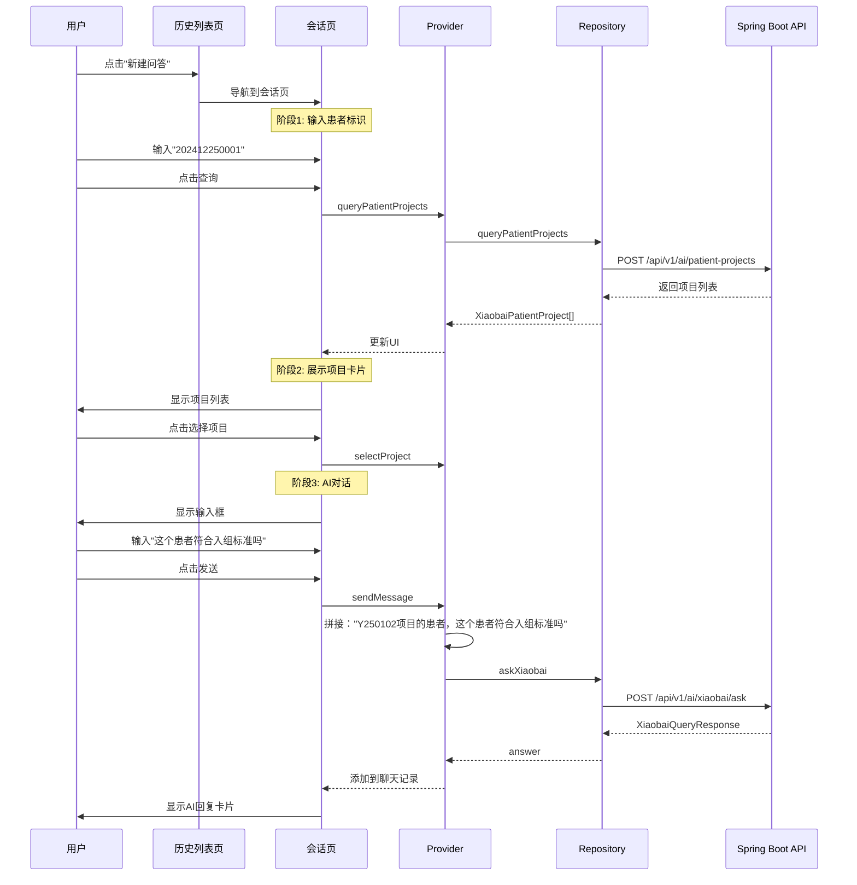

# 临床问答功能实现计划

## 1. 修改入口页面

**文件**: [`lib/features/ai/presentation/pages/ai_entry_page.dart`](lib/features/ai/presentation/pages/ai_entry_page.dart)

- 将"找患者"改为"临床问答"（3处：按钮文字、说明文案、提示）
- 修改 `_showComingSoon` 为真实的导航跳转到临床问答历史会话页面

## 2. 创建数据模型

### 2.1 患者项目模型

**新建**: `lib/features/ai/data/models/xiaobai_patient_project_model.dart`

```dart
class XiaobaiPatientProject {
  final int projectId;
  final String projectName;
  final String shortTitle;
  final String patientInNo;
  final String patientNameAbbr;
  final String statusCode;
  final String statusText;
}
```

### 2.2 小白Agent请求/响应模型

**新建**: `lib/features/ai/data/models/xiaobai_query_request.dart`

```dart
class XiaobaiQueryRequest {
  final String question;
  final int projectId;
  final String? patientName;
  final String? sessionId;
}
```

**新建**: `lib/features/ai/data/models/xiaobai_query_response.dart`

```dart
class XiaobaiQueryResponse {
  final String answer;
  final String question;
  final String projectCode;
}
```

### 2.3 临床问答会话模型

**新建**: `lib/features/ai/data/models/xiaobai_session_model.dart`

```dart
class XiaobaiSessionModel {
  final String sessionId;
  final String patientIdentifier;
  final int projectId;
  final String projectShortTitle;
  final String lastQuestion;
  final DateTime lastUpdated;
}
```

## 3. 扩展Repository

**文件**: [`lib/features/ai/data/repositories/ai_repository.dart`](lib/features/ai/data/repositories/ai_repository.dart)添加以下方法：

```dart
// 查询患者关联项目
Future<List<XiaobaiPatientProject>> queryPatientProjects(
  String patientIdentifier
)

// 小白Agent问答（非流式）
Future<XiaobaiQueryResponse> askXiaobai({
  required String question,
  required int projectId,
  String? patientName,
  String? sessionId,
})
```

## 4. 创建Provider

### 4.1 临床问答会话列表Provider

**新建**: `lib/features/ai/providers/xiaobai_session_list_provider.dart`管理临床问答历史会话列表：

- 会话列表（暂时空数据，占位UI）
- 加载状态
- 错误处理

### 4.2 临床问答Provider

**新建**: `lib/features/ai/providers/xiaobai_chat_provider.dart`管理单个临床问答会话：

- 患者标识输入
- 患者项目列表查询
- 选中的项目
- 对话记录（问题+回答列表）
- 消息发送状态
```dart
class ChatMessage {
  final String content;
  final bool isUser;
  final DateTime timestamp;
}
```


## 5. 创建UI页面

### 5.1 临床问答历史会话列表页

**新建**: `lib/features/ai/presentation/pages/xiaobai_session_list_page.dart`布局：

- 顶部：标题"临床问答"，返回按钮
- 主体：空状态提示（暂无历史会话）
- 底部：浮动按钮"新建问答"

### 5.2 临床问答会话页

**新建**: `lib/features/ai/presentation/pages/xiaobai_chat_page.dart`流程分阶段UI：**阶段1: 患者查询**

- 输入框："请输入患者姓名或住院号"
- 查询按钮
- 加载状态

**阶段2: 项目展示**

- 项目卡片列表（简单样式：项目名称 + short_title）
- 可点击选择项目

**阶段3: AI对话**

- 顶部：已选项目信息卡片
- 中间：聊天记录区（ScrollView）
- 用户消息卡片（右对齐，绿色背景）
- AI回复卡片（左对齐，白色/深色卡片，富文本渲染）
- 底部：输入框 + 发送按钮
```javascript
┌─────────────────────────┐
│ ← 临床问答              │
├─────────────────────────┤
│ [已选: Y250102项目]     │ ← 阶段3才显示
├─────────────────────────┤
│                         │
│  AI回复卡片              │
│                         │
│          用户提问卡片     │
│                         │
│  AI回复卡片              │
│                         │
├─────────────────────────┤
│ [输入框] [发送]          │
└─────────────────────────┘
```


### 5.3 项目卡片组件

**新建**: `lib/features/ai/presentation/widgets/xiaobai_project_card.dart`简单样式：

- 项目名称（大字）
- short_title（小字，灰色）
- 可点击，点击后有选中态

### 5.4 聊天消息组件

**新建**: `lib/features/ai/presentation/widgets/xiaobai_chat_message.dart`

- 用户消息：右对齐，绿色气泡
- AI消息：左对齐，卡片样式，支持富文本（✅/❌等特殊符号）

## 6. 数据流程图



## 7. 实现步骤

### 步骤1: 创建数据模型（4个文件）

- xiaobai_patient_project_model.dart
- xiaobai_query_request.dart
- xiaobai_query_response.dart
- xiaobai_session_model.dart

### 步骤2: 扩展Repository（1个文件）

- 添加 queryPatientProjects 方法
- 添加 askXiaobai 方法

### 步骤3: 创建Provider（2个文件）

- xiaobai_session_list_provider.dart
- xiaobai_chat_provider.dart

### 步骤4: 创建UI组件（2个文件）

- xiaobai_project_card.dart
- xiaobai_chat_message.dart

### 步骤5: 创建页面（2个文件）

- xiaobai_session_list_page.dart
- xiaobai_chat_page.dart

### 步骤6: 修改入口（1个文件）

- ai_entry_page.dart

## 8. 技术要点

1. **消息前缀处理**: 在 Provider 的 `sendMessage` 方法中自动拼接项目前缀
2. **富文本渲染**: AI回复支持 `✅`/`❌` 等特殊符号，保持换行格式
3. **会话管理**: 使用 UUID 生成 sessionId，多轮对话使用相同 sessionId