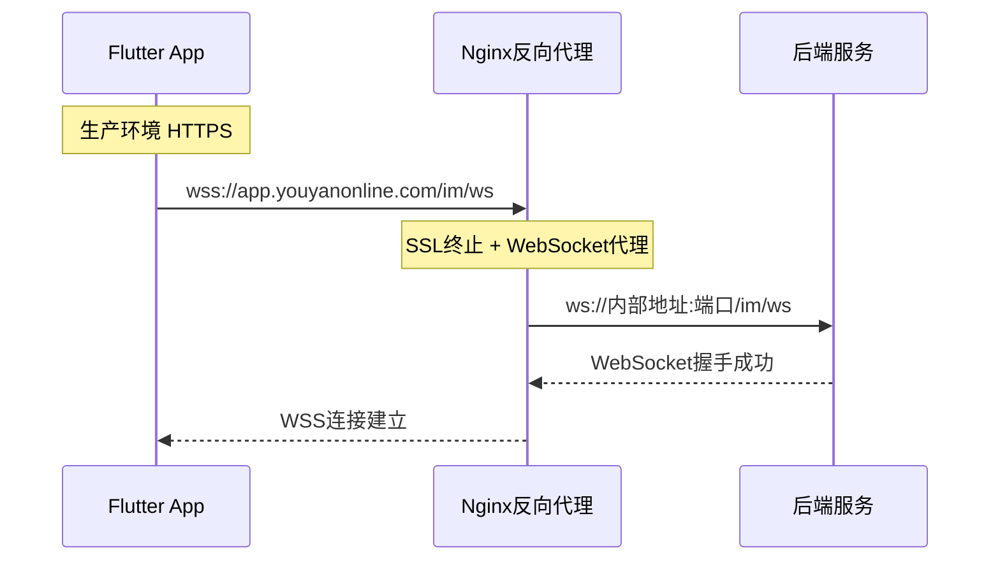

# 修复IM模块WebSocket连接协议问题

## 问题分析

从错误日志可以看出：

```
Connection to 'http://app.youyanonline.com:443/im/ws?token=...' was not upgraded to websocket
```

**根本原因**：[websocket_service.dart](lib/features/im/data/services/websocket_service.dart) 第83行硬编码了 `ws://` 协议：

```83:lib/features/im/data/services/websocket_service.dart
    _baseWsUrl = 'ws://$host:$port/im/ws';
```

当生产环境使用 HTTPS 时，WebSocket 应该使用 `wss://`（WebSocket Secure），但代码始终使用 `ws://`。

## 修改方案

### 1. Flutter 客户端修改

修改 [websocket_service.dart](lib/features/im/data/services/websocket_service.dart) 的 `connect` 方法：

```dart
/// 连接 WebSocket
Future<void> connect(String host, int port, String token, {
  Future<String> Function()? tokenGetter,
  bool useSecure = false,  // 新增参数
}) async {
  if (_state == WebSocketState.connected ||
      _state == WebSocketState.connecting) {
    return;
  }

  _host = host;
  _port = port;
  // 根据 useSecure 决定使用 ws:// 还是 wss://
  final wsScheme = useSecure ? 'wss' : 'ws';
  _baseWsUrl = '$wsScheme://$host:$port/im/ws';
  _tokenGetter = tokenGetter;
  _manualDisconnect = false;

  await _connectWithToken(token);
}
```

同时需要修改以下调用方，传入正确的 `useSecure` 参数：

- [login_page.dart](lib/features/auth/presentation/pages/login_page.dart) - `_connectWebSocket` 方法
- [home_page.dart](lib/features/home/presentation/pages/home_page.dart) - `_ensureWebSocketConnection` 方法
- [websocket_provider.dart](lib/features/im/providers/websocket_provider.dart) - `connect` 和 `_reconnectIfNeeded` 方法

判断逻辑：根据 `baseUrl` 的 scheme 是否为 `https` 来决定 `useSecure`：

```dart
final baseUrl = await EnvConfig.resolveApiBaseUrl();
final uri = Uri.parse(baseUrl);
final useSecure = uri.scheme == 'https';
```

### 2. 服务器端配置

服务器需要确保 WebSocket 端点支持 WSS 连接。如果使用 **Nginx 反向代理**，需要添加以下配置：

```nginx
location /im/ws {
    proxy_pass http://后端服务地址:端口/im/ws;
    proxy_http_version 1.1;
    proxy_set_header Upgrade $http_upgrade;
    proxy_set_header Connection "upgrade";
    proxy_set_header Host $host;
    proxy_set_header X-Real-IP $remote_addr;
    proxy_set_header X-Forwarded-For $proxy_add_x_forwarded_for;
    proxy_set_header X-Forwarded-Proto $scheme;
    
    # WebSocket 超时配置
    proxy_read_timeout 86400s;
    proxy_send_timeout 86400s;
}
```

关键配置说明：

- `proxy_set_header Upgrade $http_upgrade` - 转发 WebSocket 升级请求头
- `proxy_set_header Connection "upgrade"` - 保持连接升级
- `proxy_read_timeout` - WebSocket 长连接超时时间

## 数据流图



## 总结

| 修改位置 | 修改内容 |

|---------|---------|

| `websocket_service.dart` | 添加 `useSecure` 参数，动态选择 ws/wss |

| `websocket_provider.dart` | 传递 `useSecure` 参数 |

| `login_page.dart` | 根据 baseUrl scheme 决定 useSecure |

| `home_page.dart` | 同上 |

| 服务器 Nginx | 配置 WebSocket 代理支持 |