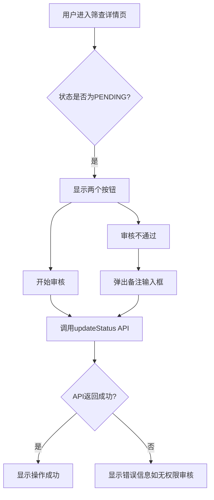

# 筛查审核拒绝功能实现

## 变更背景

后端API进行了以下变更：

1. 筛查待审核(`PENDING`)时可以进行拒绝操作（状态变更为`MATCH_FAILED`）
2. 筛查待审核时，只有项目相关的CRC才能进行审核操作

## 需要修改的文件

### 1. [screening_detail_provider.dart](lib/features/screening/providers/screening_detail_provider.dart)

修改 `availableActions` getter，在 `PENDING` 状态下增加拒绝操作：

```dart
case 'PENDING':
  return ['CRC_REVIEW', 'MATCH_FAILED']; // 增加 MATCH_FAILED（审核不通过）
```

### 2. [screening_detail_page.dart](lib/features/screening/presentation/pages/screening_detail_page.dart)

修改 `_getActionText` 方法，为 `PENDING` 状态下的 `MATCH_FAILED` 显示更合适的按钮文案"审核不通过"：

```dart
String _getActionText(String action, {String? currentStatus}) {
  // PENDING 状态下的 MATCH_FAILED 显示为"审核不通过"
  if (action == 'MATCH_FAILED' && currentStatus == 'PENDING') {
    return '审核不通过';
  }
  // 其他情况保持原有逻辑
  const actionMap = {
    'CRC_REVIEW': '开始审核',
    'MATCH_FAILED': '标记筛查失败',
    // ...
  };
  return actionMap[action] ?? action;
}
```

## 权限提示处理

当非CRC角色点击"开始审核"或"审核不通过"时：

- 后端API会返回错误码 `FORBIDDEN`，消息为"只有项目CRC才能审核通过"或"不能审核自己发起的筛查请求"
- 当前代码已在 `updateStatus` 方法中捕获 `ApiException` 并设置 `errorMessage`
- UI层 `_showConfirmDialog` / `_showRemarkDialog` 已通过 SnackBar 显示 `provider.errorMessage`
- **无需额外修改**，后端返回的错误信息会自动显示给用户

## 实现逻辑流程

